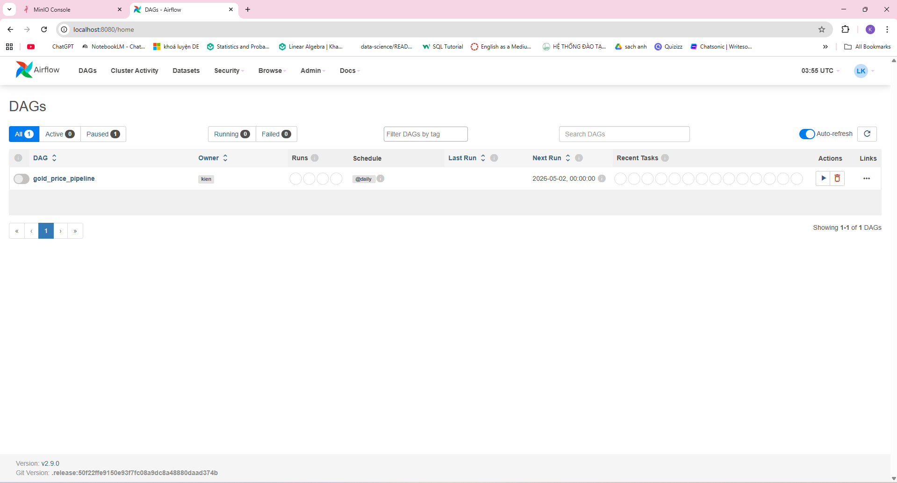

# Gold Price Pipeline & Prediction

An end-to-end data pipeline that ingests macroeconomic data (DXY, Fedfunds, CPI, Treasury Yield), processes it using a medallion architecture (bronze => silver => gold), and trains a machine learning model to predict gold price.

Built with Python, Minio, Docker and Airflow

## #Business Problem

Gold price is influenced by multiple macroeconomic factors such as inflation, USD strength, interest rates, These data sources are often require intergration and transformation before analysis.

This project builds an automated pipeline to:
- Collect data from multiple sources
- Standardize and store them
- Generate features for machine learning
- Predict gold price trends

## #Data Flow
1. Ingestion
    - Fetch data from multiple sources , APIs (gold, USD, oil)
    - Apply retry, logging
    - Store raw data -> Minio (Bronze)
2. Storage (Bronze)
    - Immutable raw data
    - Partition by date
3. Transformation (Silver)
   - Clean & Normalize data
   - Handle missing values
   - Align time-series
4. Feature Engineering
   - Lag features (t-1, t-7,..)
   - Rolling mean, std...
   - Output ML-ready dataset
5. ML Pipeline
   - Train model
   - Evaluate performance
   - Save model artifacts
6. Orchestration
   - Airlow DAG schedules pipeline (daily)
   - Manage dependencies & retries

## #Tech stack

- Language: Python
- Storage: Minio
- Data processing: Pandas
- ML: Scikit-learn
- Infrastructure: Docker, Docker compose
- Orchestration: Apache Airflow

## #Project Structure

gold-price-pred

    ├── dags/                  # Airflow DAGs
    ├── source-code/
    │   ├── ingestion/        # Data ingestion scripts
    │   ├── features/         # Feature engineering
    │   ├── ml/               # Model training
    ├── configs/              # Environment config
    ├── docker-compose.yml
    ├── Dockerfile
    ├── docker_env.env
    ├── .gitignore

## #How to run ?

### 1. Clone repo
git clone ...
cd gold-price-pred
### 2. Start services
docker-compose up --build
    
- Airflow UI: http://localhost:8080
   
- Minio UI: http://localhost:9000

### 3. Trigger DAG
Open Airflow UI

Enable DAG: gold-price-pipeline

### 4. Output
- Raw data (Minio)
- Clean data (Silver)
- Features (Ml ready dataset)
- Prediction -> output file/storage

## #Key learning
- Getting more influence on how to design end-to-end pipeline
- Handling multi-source data ingestion
- Using Minio as datalake
- Cleaning data, prepare features for ML with time series data 
- Orchestrating workflows with Airflow
